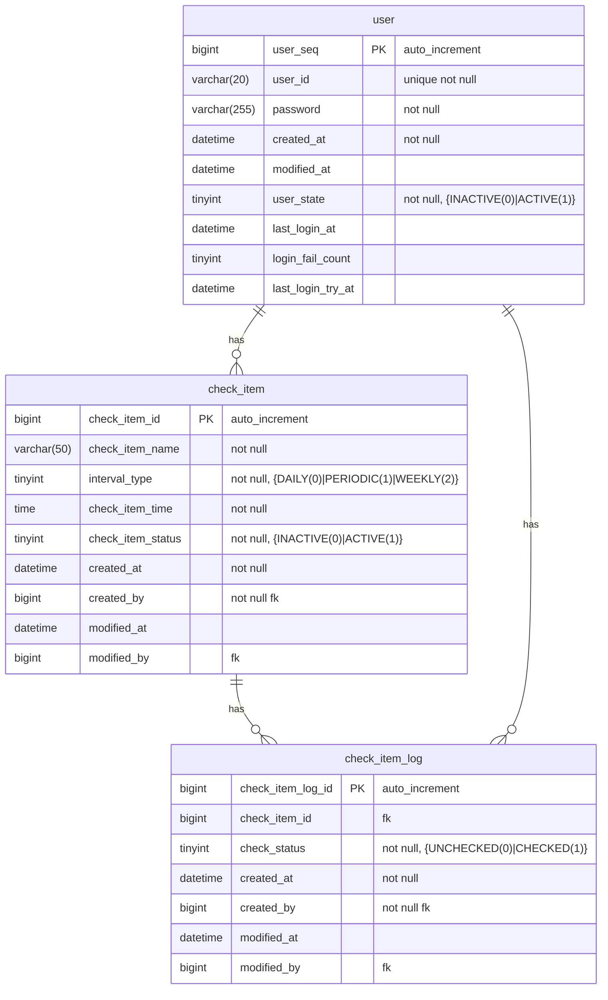

# Check List Project

체크리스트 프로젝트입니다.

## 📌 프로젝트 개요
- **프로젝트명**: Check List
- **버전**: 0.0.1-SNAPSHOT
- **개발 언어**: Java 17
- **빌드 도구**: Gradle
- **프레임워크**: Spring Boot 3.4.3
- **데이터베이스**: H2 Database (개발 환경)

## 🛠 기술 스택
- **Backend**
    - Java 17
    - Spring Boot 3.4.3
    - Spring Security
    - Spring Data JPA
    - H2 Database (개발 환경)
- **Frontend**
    - Thymeleaf
    - Thymeleaf Extras Spring Security
- **빌드 & 의존성 관리**
    - Gradle (Dependency Management Plugin 사용)
- **기타**
    - Lombok (개발 편의성 향상)
    - Spring Boot DevTools (개발 환경 개선)
    - JUnit & Spring Security Test (테스트 코드 지원)

## 📌 문서
### API 앤드포인트 문서
- [API 엔드포인트 문서](https://docs.google.com/spreadsheets/d/1O4Lt4XLUSuWpnqbprD0W4OX3QSt-zPvkV9g9qBqqtTA/edit?gid=0#gid=0)

### erd
- [테이블 정의서](https://docs.google.com/spreadsheets/d/1O4Lt4XLUSuWpnqbprD0W4OX3QSt-zPvkV9g9qBqqtTA/edit?gid=1430982991#gid=1430982991)
